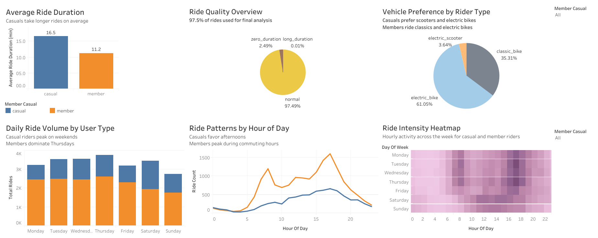

# 🚲 Cyclistic Bike-Share Case Study

## 📌 Project Overview

This case study explores usage patterns between **casual riders** and **annual members** of Cyclistic, a fictional bike-share program in Chicago. The goal is to uncover behavioral differences and generate actionable recommendations to **convert casual riders into members**, increasing customer retention and long-term revenue.

## 🎯 Business Task

> How do annual members and casual riders use Cyclistic bikes differently?

Using 12 months of trip data, I cleaned, transformed, and analyzed usage behavior using SQL and created interactive visualizations in Tableau to support strategic decision-making.

---

## 🛠 Tools Used

- **MySQL** for data cleaning, transformation, and analysis
- **Tableau Public** for visualization

---

## 📊 Key Insights

| Metric | Casual Riders | Annual Members |
|--------|----------------|----------------|
| Avg Ride Duration | 16.5 minutes | 11.2 minutes |
| Peak Usage Day | Saturday | Thursday |
| Peak Hour | 17:00 | 07:00 & 17:00 |
| Ride Type | Electric bikes, scooters | Classic bikes |

- Casual riders prefer **weekends & afternoons**, often for leisure.
- Members ride more **frequently on weekdays**, suggesting commuting patterns.
- Casuals use electric bikes/scooters more; members prefer classic/electric bikes.

---

## 📌 Data Source

Public bike-share data provided by Motivate International Inc., covering:
- Timeframe: **July 2024 – June 2025**
- Source: [https://divvy-tripdata.s3.amazonaws.com/index.html] 🔗

---

## 🧹 Data Cleaning Summary

- Merged 12 CSV files into unified SQL view `all_trips`
- Converted timestamps to valid DATETIME
- Removed/flagged anomalies:
  - `ride_length = 00:00:00`
  - `ride_length > 24 hours`
- Created features: `ride_length`, `day_of_week`, `hour_of_day`, `ride_flag`

> See full SQL scripts in 📄 [cyclistic_case_study.sql](cyclistic_case_study.sql)

---

## 📈 Tableau Dashboard

🔗 [View Tableau Dashboard][https://public.tableau.com/app/profile/sidney.dang/viz/CasualvsMemberRidePatternsCyclisticAnalysis/CyclisticDashboard]

---

## ✅ Recommendations

1. **Target casual riders** during peak leisure times (weekend afternoons) with promotional offers.
2. **Promote membership value** by highlighting cost savings, especially for high-frequency casual riders.
3. **Fleet Optimization**: Allocate electric bikes/scooters to weekend hubs; reserve classic bikes for weekday commuter stations.

---

## 📁 Repository Contents

| File | Description |
|------|-------------|
| `README.md` | Project documentation |
| `data_prep.sql` | SQL script to clean and prepare data |
| `analysis.sql` | SQL queries for analysis and insights |
| `images/` | Tableau screenshots |
| `Cyclistic_Case_Study_Report.pdf` | Full report summary (optional) |

---

## 🧠 Learnings

- Practiced real-world SQL skills on large dataset
- Improved data storytelling and dashboard design with Tableau
- Gained deeper understanding of customer segmentation in marketing analytics

---

## 💬 Contact

Feel free to connect with me on [LinkedIn](https://linkedin.com/in/sidney-dang) or email at kyledang2711@gmail.com if you'd like to discuss this project or any opportunities.
